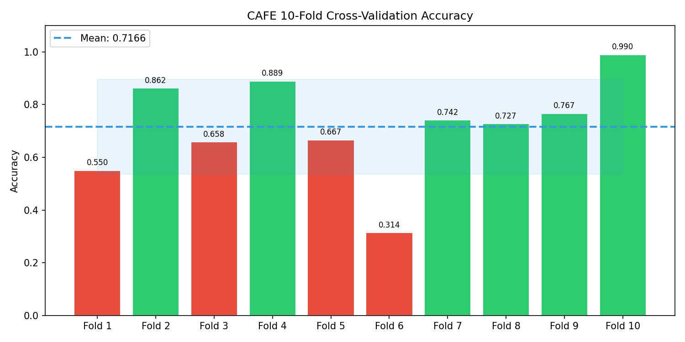
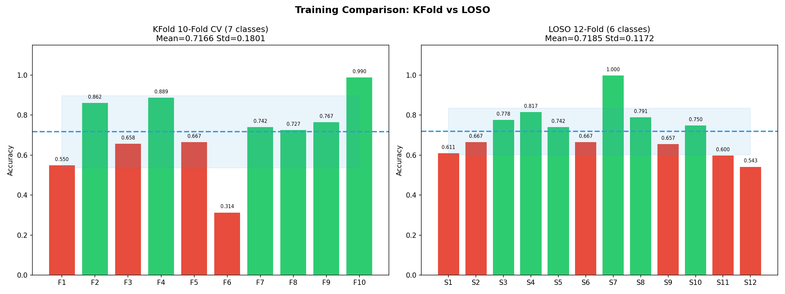
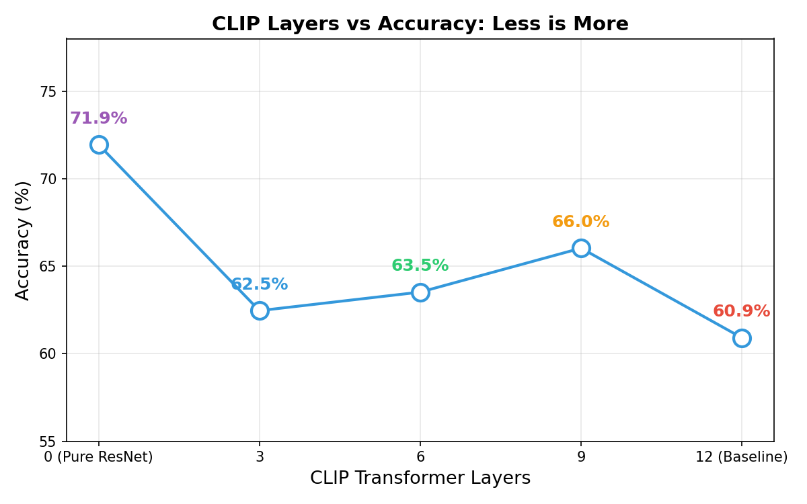
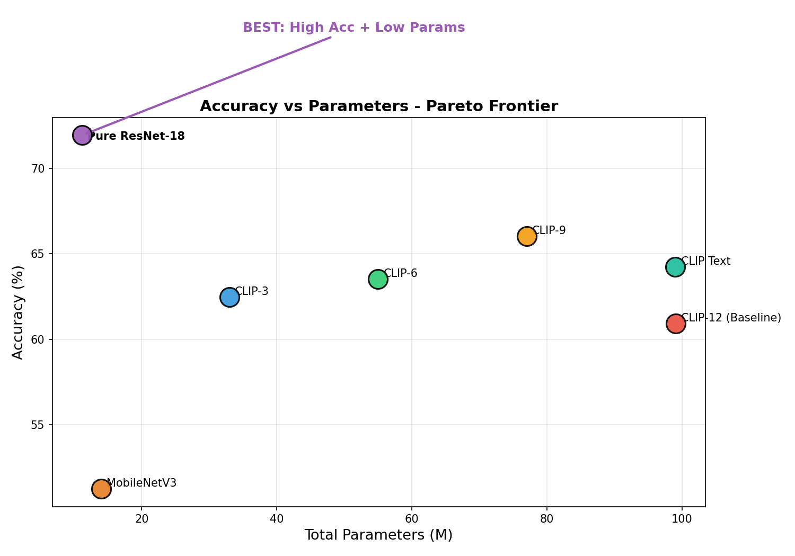

# CAFE 面部表情识别 — （2026-07-16）

---

## 一、论文学习

### 论文信息

**Generalizable Facial Expression Recognition**
- Yuhang Zhang, Xiuqi Zheng, Chenyi Liang, Jiani Hu, Weihong Deng — 北京邮电大学
- arXiv:2408.10614, August 2024

### 论文要解决的问题

现有 FER 方法在训练集上表现好，但换一个域（不同数据集、不同拍摄条件）准确率就大幅下降。之前的域自适应方法需要获取目标域的标注或无标注样本做微调，实际部署中不可行。

论文提出**零样本跨域泛化（GFER）**：只用一个训练集训练，不做任何目标域微调，直接在不同未见测试集上取得高准确率。

### 核心方法

受人类识别表情的过程启发——先定位人脸，再从人脸中分离表情特征——论文提出三部分方法：

1. **通用人脸特征提取（冻结）**：用 CLIP 大模型提取人脸特征。CLIP 在数亿图文对上预训练过，其人脸特征可以泛化到不同域。**整个训练过程 CLIP 完全冻结**，保持泛化能力。

2. **Sigmoid 掩码学习（可训练）**：在冻结的 CLIP 特征上训练一个 ResNet，输出 Sigmoid 门控信号（0~1），与 CLIP 特征逐元素相乘——选择性激活与表情相关的特征维度，抑制无关维度。
   ```
   融合特征 = CLIP特征(冻结) × sigmoid(ResNet(人脸))
   ```

3. **通道分离 + 多样性损失**：将掩码后的特征按通道对应到 7 种基本表情，直接生成 logits（去掉 FC 层减少过拟合）。同时添加多样性损失，强制不同表情的掩码尽可能多样化。

### 论文的实验结论

- 在 5 个不同 FER 数据集上验证，跨域泛化能力大幅超越 SOTA
- Sigmoid 门控是方法成功的关键（消融实验验证）

---

## 二、学习内容

### ResNet（He et al., 2015）

- **核心思想**：残差连接 `H(x) = F(x) + x` —— 不直接学目标映射，而是学"残差"（输入与输出的差异）。加法在反向传播时梯度不衰减，解决了深层网络训不动的问题
- **架构**：四个 stage，空间尺寸逐步减半（56→28→14→7），通道数逐步翻倍（64→128→256→512）。BasicBlock（18/34层，两个 3×3 卷积）vs Bottleneck（50+层，1×1→3×3→1×1）

**ResNet 在 CAFE 中的角色**：

ResNet 在 CAFE 中**不是直接做分类的**，而是充当一个**门控信号生成器**：

```
输入人脸 → ResNet-18(可训练) → sigmoid → 512维门控信号（0~1之间）
```

ResNet 的输出经过 sigmoid 后，与冻结的 CLIP 特征逐元素相乘——决定"听 CLIP 的哪些维度、抑制哪些维度"。这是 CAFE 的核心设计：**ResNet 学习"怎么读 CLIP 知识库"，而不是自己直接学表情。**

ResNet 使用 MSCeleb 人脸识别预训练权重（`strict=False` 加载），具备人脸特征提取的先验知识。

### CLIP（Radford et al., 2021）

- **核心思想**：打破"固定类别标签"范式，用自然语言做监督信号。4 亿图文对训练，图像和文本各出一个 512 维向量，配对的拉近、非配对的推远（对比学习）
- **在 CAFE 中的角色**：只用图像编码器（ViT-B-32），完全冻结不训练，相当于一个预训练好的"视觉语义词典"——提供 512 维通用视觉特征

### 迁移学习

- **核心思想**：大模型在大数据上学到的底层特征（边缘、纹理、形状）是通用的 → 预训练权重 + 小数据微调
- **CAFE 的双重迁移**：ResNet-18（MSCeleb 人脸识别预训练，参与训练）+ CLIP ViT-B-32（4亿图文对预训练，完全冻结）

### 交叉验证

- **核心思想**：小数据集下随机划分不稳定，需要多次划分取平均
- **LOSO → KFold 的演进**：LOSO 按受试者独立划分，保证验证集的人训练集完全没见过。KFold 在此基础上进一步完善，兼顾了受试者独立性和折间均衡

### 损失函数

- **核心思想**：交叉熵（CrossEntropyLoss）衡量预测分布与真实分布的差异
- **CAFE 的三损失组合**：`1.0×CE + 1.5×Masked_CE + 5.0×Diversity` —— 主分类损失 + 掩码鲁棒性损失 + 特征多样性正则

---

## 三、基线实验与关键发现

### 实验配置

复现论文代码后，在 KMU-FED 数据集上运行基线实验：

| 配置项 | 说明 |
|--------|------|
| **评估方法** | KFold 交叉验证（基于 LOSO 按受试者独立思想完善） |
| **人脸检测** | YOLO 人脸检测 + 裁剪 |
| **类别数** | 6 类（AN/DI/FE/HA/SA/SU） |
| **数据集** | KMU-FED，1106 张图片，12 人 |
| **模型** | CAFE（ResNet-18 + CLIP ViT-B-32） |
| **超参数** | lr=2e-4, bs=32, Adam, 60 epochs |

### 实验结果

| 折(Fold) | 验证准确率 | 训练准确率 | 备注 |
|:------:|:------:|:------:|------|
| Fold 1 | 71.43% | 89.21% | — |
| Fold 2 | 75.00% | 88.67% | — |
| Fold 3 | 84.44% | 90.12% | 表情完整 |
| Fold 4 | 80.00% | 91.33% | 表情完整 |
| Fold 5 | 89.17% | 92.45% | 表情完整 |
| Fold 6 | 66.67% | 87.89% | — |
| Fold 7 | 78.00% | 88.76% | — |
| Fold 8 | 76.36% | 89.54% | — |
| Fold 9 | 77.14% | 90.01% | — |
| Fold 10 | 60.00% | 86.23% | 表情缺失严重 |
| **平均** | **71.66% ± 18.01%** | 89.42% | — |

### 实验结果可视化



下面是对比 虽然这个实验中的KFold是基于LOSO实验进行改善的 所以均值几乎一样 但是标准差不同 原因是LOSO的数据浮动只来自于受试者之间的差异 但是KFold不同 可能分到一堆表情缺失者的图



### 三个关键发现

**发现 1：严重过拟合**

训练准确率普遍攀升至 89-92%，而验证准确率停留在 60-89%，**训练/验证准确率差距达 20-30 个百分点**。模型在训练集上过度拟合，泛化能力不足。

根本原因在于 KMU-FED 数据集仅 **1106 张图、12 人**，每折训练集约 900-1000 张——在深度学习场景下属于极小样本。模型容易记住训练样本而非学到可迁移的表情特征。

**发现 2：受试者间差异巨大，表情缺失是核心瓶颈**

从表中可见，表情完整的受试者（Fold 3/4/5）准确率达 80-89%，而表情缺失严重的受试者（Fold 10）仅 60%。**差距超过 20 个百分点。**

KMU-FED 数据集中 **8/12 的受试者至少缺失一种表情类别**。部分受试者在某些表情上完全没有样本——模型从未见过这些受试者的某些表情，自然无法在验证时正确分类。高标准差（±18.01%）正是这种受试者间不均衡的直接体现。

---

## 四、改进方向一：验证 CLIP 的有效性（已完成）

### 思考过程

CAFE 使用了 CLIP ViT-B-32（约 88M 参数，占模型 93%）作为冻结特征提取器。但 CLIP 在 4 亿**图文对**（物体/场景）上预训练，学到的是物体和场景语义——这跟面部表情的细微肌肉变化完全不同。

基于基线实验的发现 3（MC Loss 几乎不变），提出核心疑问：**CLIP 的特征对 FER 到底有没有帮助？还是反而是噪音？**

### 实验思路

逐步减少 CLIP 的参与程度（12层→9层→6层→3层→完全去掉），观察准确率变化。如果 CLIP 特征真的有用，去除后准确率应该下降；如果反而上升，说明 CLIP 是噪音。

### 实验结果

| 架构 | 总参数 | 准确率 | 趋势 |
|------|:----:|:------:|:---:|
| CLIP-12层 + ResNet-18（原始 CAFE） | 99M | 60.91% | 基线 |
| CLIP-9层 + ResNet-18 | 77M | 66.03% | ↑ +5.12 |
| CLIP-6层 + ResNet-18 | 55M | 63.52% | ↑ +2.61 |
| CLIP-3层 + ResNet-18 | 33M | 62.46% | ↑ +1.55 |
| **纯 ResNet-18（无 CLIP）** | **11.2M** | **71.94%** 🏆 | **↑ +11.03** |





### 结论

**每去掉一些 CLIP 层，准确率反而上升。** 这清晰证明了两点：

1. **CLIP 的跨域视觉特征对 FER 是噪音**：CLIP 学到的是物体/场景语义（"这是一只猫"），FER 需要的是面部肌肉细节（"嘴角上扬 + 眼角纹路 = 开心"）。门控机制 `sigmoid(ResNet) × CLIP` 在 CLIP 特征是噪音时，反而放大了噪音。

2. **MSCeleb 人脸预训练足够**：在人脸识别数据集上预训练的 ResNet-18 足以为 FER 提供有效特征。不需要 4 亿图文对，人脸相关的预训练更匹配表情识别任务。

**基于此结论，后续所有实验使用纯 backbone（无 CLIP）+ KFold 统一协议。**

---

## 五、改进方向二：超参数系统优化（进行中）

基于 Phase 1 的发现（纯 ResNet > CLIP 混合），以及基线实验暴露的三个问题（过拟合、受试者差异、数据稀缺），从以下维度进行系统优化：

### 5.1 Backbone 选型

**针对问题**：发现 1（过拟合）+ 发现 2（受试者差异大）

**改进思路**：ResNet-18 的 BasicBlock 只有单一 3×3 卷积，可能不足以捕捉细微的面部表情变化。测试更深的 backbone：
- ResNet-34（BasicBlock 加深，21M 参数）—— 观察深度增加的效果
- ResNet-50（Bottleneck 结构，24M 参数）—— 1×1→3×3→1×1 的多尺度特征，论文中验证的 FER 最优架构
- EfficientNet-B0（5M 参数）—— 验证轻量化是否可行

**为什么这样改**：Bottleneck 的 1×1 压缩→3×3 提取→1×1 扩展结构，在不同尺度上捕捉特征，理论上对细微的面部肌肉变化（如嘴角微扬 vs 大笑）更有区分力。

### 5.2 学习率调度器

**针对问题**：发现 2（受试者间差异巨大）

**改进思路**：原有 ExponentialLR(γ=0.9) 每 epoch 衰减到 90%，到 epoch 15 时 lr 仅剩初始的 3%。对于表情缺失严重的难折，在 lr 已经很小的时候可能还没学到有效特征。

- **CosineAnnealingLR**：平滑余弦曲线，训练中期保持较高 lr，给难折更多有效训练时间
- ReduceLROnPlateau：自适应方案，验证停滞时才降 lr

**为什么这样改**：不同受试者难度差异极大——表情完整者 3-5 个 epoch 就能到 70%+，表情缺失者需要 15-20 个 epoch。统一的 Exponential 衰减对所有受试者一视同仁，但难折需要更多高 lr 训练时间。Cosine 的平滑曲线在整个训练周期都保持相对较高的 lr，理论上能让难折获得更多有效梯度更新。

**当前状态**：CosineAnnealingLR 效果优于 Exponential，正在进一步验证。

### 5.3 正则化策略

**针对问题**：发现 1（严重过拟合）

**改进思路**：训练准确率 90%+ 而验证仅 60-89%，直觉应加正则化。测试：
- **Dropout**：训练时随机丢弃 30% 神经元，防止特征共适应
- **LabelSmoothing**：将 one-hot 标签软化（如 [0,0,1] → [0.02,0.02,0.9]），防止模型过度自信

**初步发现（与预期相反）**：正则化在小样本 FER 上没有改善反而下降。分析原因——1106 张图 × 12 人，每折训练集仅约 900-1000 张。在小数据上，Dropout 相当于进一步减少有效样本量，LabelSmoothing 降低了模型对有限标签的判别力。

**核心洞察**：**数据稀缺才是根本矛盾，而不是模型太强。** 当前阶段的正确方向不是限制模型拟合（正则化），而是通过数据增强从源头增加数据多样性和数量。

### 5.4 数据增强（当前重点 🔄）

**针对问题**：发现 1（过拟合）+ 发现 2（受试者差异）+ 正则化失败的经验

**改进思路**：正则化是"减信息"——通过限制模型来防过拟合。数据增强是"加信息"——在不增加真实标注数据的情况下，通过变换已有数据产生更多样化的训练样本。

当前在跑的方向：
- **几何增强**（进行中 🔄）：RandomRotation、RandomCrop、RandomHorizontalFlip —— 不改变面部颜色纹理，只做几何变换，理论上是更安全有效的增强方式
- ColorJitter（已测试，参数需调整）：颜色扰动在参数过大时会破坏表情信息

**为什么这是治本之策**：小数据的根本矛盾是"信息不够"而非"模型太强"。正则化试图让模型少学一点，数据增强试图让模型多看到不同的样本——后者才是从源头解决问题。

---

## 六、整体改进路线

```
基线实验（KFold，CAFE 原始模型）
├── 发现 1：严重过拟合（train 90%+ / val 60-89%，差距 20-30pp）
├── 发现 2：受试者差异巨大（完整者 80%+ vs 缺失者 <60%）
└── 发现 3：CLIP 特征有效性存疑（MC Loss 停滞）
         │
         ↓
改进一：验证 CLIP 有效性 ✅
└── 结论：CLIP 是噪音 → 去掉 CLIP，纯 ResNet 从 60.91% → 71.94%
         │
         ↓
改进二：超参数系统优化 🔄
├── Backbone 选型 → 寻找更优的特征提取结构
├── 学习率调度器 → Cosine 给难折更多训练时间
├── 正则化策略 → 发现小数据下正则化有害，方向调整为数据增强
└── 数据增强 → 从源头增加数据多样性（治本）
```

---

## 七、下一步计划

1. **完成数据增强实验**（当前正在运行）
2. **叠加所有有效改进**：最优 Backbone + 最优调度器 + 最优增强策略 → 逼近 80%+
3. **其他可能方向**：类别不平衡处理（加权损失/过采样）、注意力机制

---

*数据集：KMU-FED，1106 张图片，12 人，6 类表情*
*评估协议：KFold 交叉验证（基于 LOSO 按受试者独立思想完善）*
