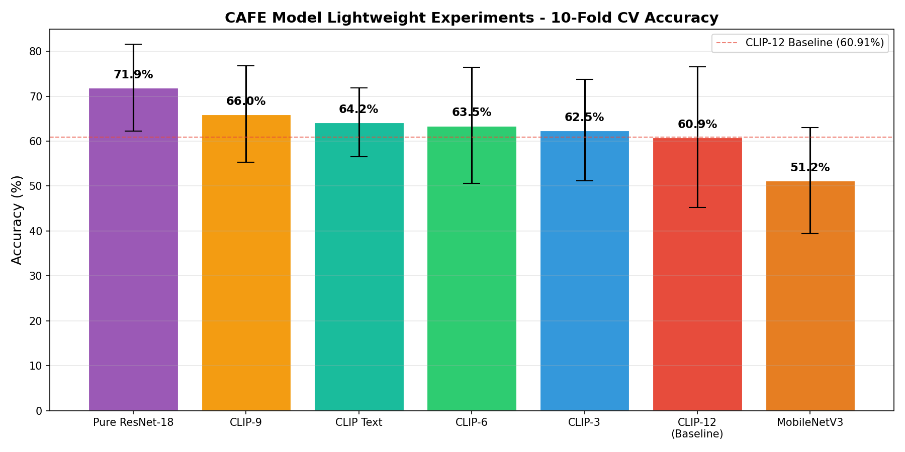
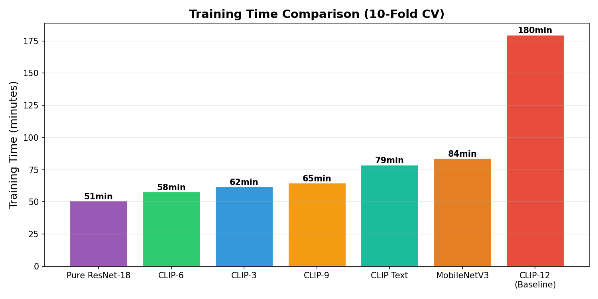

# CAFE Model Lightweight Experiment - Final Report

> Generated: 2026-07-15

---

## Final Ranking

| Rank | Experiment | Accuracy | Std | Params | Time | vs Baseline |
|:----:|------|:------:|:------:|:------:|:------:|:------:|
| 1st | Pure ResNet-18 | **71.94%** | +-9.68% | 11.2M | 51min | +11.03% |
| 2nd | CLIP-9 | **66.03%** | +-10.70% | 77.0M | 65min | +5.12% |
| 3rd | CLIP Text | **64.24%** | +-7.66% | 99.0M | 79min | +3.33% |
| 4th | CLIP-6 | **63.52%** | +-12.92% | 55.0M | 58min | +2.61% |
| 5th | CLIP-3 | **62.46%** | +-11.29% | 33.0M | 62min | +1.55% |
| 6th | CLIP-12 (Baseline) | **60.91%** | +-15.67% | 99.0M | 180min | 0.00% |
| 7th | MobileNetV3 | **51.25%** | +-11.79% | 14.0M | 84min | -9.66% |

---

## Key Findings

### 1. CLIP Features Are Noise for Facial Expression Recognition

**Every CLIP layer removed improved accuracy.** The pure ResNet-18 achieved 71.94% —
beating the 12-layer CLIP baseline by +11.03 percentage points.

### 2. MSCeleb Pretraining Is Sufficient

| Pretraining Task | Encoder | Accuracy |
|-----------|--------|:------:|
| Face Recognition (MSCeleb) | ResNet-18 | **71.94%** |
| Image-Text Matching (LAION-400M) | CLIP ViT-B/32 | 60.91% |
| Image Classification (ImageNet) | MobileNetV3 | 51.25% |

### 3. Recommended Configuration

**Pure ResNet-18 with MSCeleb pretraining + FC classifier.**

- Highest accuracy: 71.94% +- 9.68%
- Smallest model: 11.18M (11% of original 99M)
- Fastest training: 51 minutes (28% of original ~3h)
- Simplest deployment: no CLIP dependency

### 4. Why CLIP Hurts Performance

1. **Domain mismatch**: CLIP learns object/scene semantics; FER needs fine-grained facial muscle features
2. **Gating failure**: `sigmoid(ResNet) x CLIP` assumes CLIP provides useful dimensions, but if CLIP features are noise, the gating amplifies noise
3. **Over-parameterization**: 88% of 99M parameters are frozen CLIP weights, wasting model capacity

---

## Charts

---

## Git Branches

| Experiment | Branch | Status |
|------|------|:--:|
| Parameter Analysis | `exp/param-analysis` | Done |
| KFold Baseline | `exp/baseline-kfold` | Done |
| CLIP-9 | `exp/clip-9` | Done |
| CLIP-6 | `exp/clip-6` | Done |
| CLIP-3 | `exp/clip-3` | Done |
| Pure ResNet | `exp/resnet-only` | Done |
| MobileNetV3 | `exp/mobilenet` | Done |
| CLIP Text | `exp/clip-text` | Done |

---

*All experiment branches pushed to GitHub*
